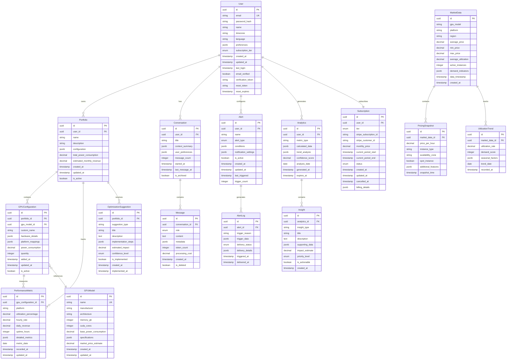

# Data Models

## Entity Relationship Diagram



## Core Entities

### User
**Purpose**: Central entity for authentication, preferences, and subscription management

**Key Attributes**:
- `id`: UUID primary key for distributed architecture compatibility
- `email`: Unique identifier for authentication and communication
- `password_hash`: Bcrypt hashed password for security
- `subscription_tier`: Enum (free, individual, professional, enterprise)
- `preferences`: JSONB for flexible user customization
- `timezone`: For localized data presentation and alert timing

**Relationships**:
- One-to-many with Portfolio (users can have multiple GPU setups)
- One-to-many with Conversation (AI chat history)
- One-to-many with Alert (notification preferences)
- One-to-one with Subscription (billing relationship)

**Indexes**:
- Primary: `id` (UUID)
- Unique: `email`
- Composite: `(subscription_tier, created_at)` for analytics
- Partial: `verification_token` where not null

**Constraints**:
- Email format validation
- Password complexity requirements
- Timezone must be valid IANA timezone
- Subscription tier must match enum values

### Portfolio
**Purpose**: Represents a user's GPU hosting setup, supporting multiple configurations

**Key Attributes**:
- `configuration`: JSONB for flexible hardware description
- `total_power_consumption`: Calculated field for cost analysis
- `estimated_monthly_revenue`: AI-calculated projection
- `is_active`: Soft delete and active status management

**Relationships**:
- Many-to-one with User (portfolio owner)
- One-to-many with GPUConfiguration (individual GPU instances)
- One-to-many with PerformanceMetric (historical performance)
- One-to-many with OptimizationSuggestion (AI recommendations)

**Business Rules**:
- Free tier users limited to 1 portfolio
- Individual tier users limited to 3 portfolios
- Professional tier users have unlimited portfolios
- Portfolio must have at least 1 GPU configuration to be active

### GPUConfiguration
**Purpose**: Individual GPU instance within a portfolio, with platform-specific mappings

**Key Attributes**:
- `hardware_details`: JSONB for overclock settings, cooling, etc.
- `platform_mappings`: JSONB linking to RunPod, Lambda Labs instances
- `quantity`: Support for multiple identical GPUs
- `custom_name`: User-friendly naming for organization

**Relationships**:
- Many-to-one with Portfolio (belongs to portfolio)
- Many-to-one with GPUModel (references standard GPU specifications)
- One-to-many with PerformanceMetric (performance tracking)

**Business Rules**:
- Must reference valid GPUModel
- Power consumption calculated from base model + overclocking
- Platform mappings validated against known platform APIs
- Quantity must be positive integer

### MarketData
**Purpose**: Aggregated market intelligence from 500.farm and other sources

**Key Attributes**:
- `gpu_model`: Reference to specific GPU model for pricing
- `platform`: Hosting platform (RunPod, Lambda Labs, etc.)
- `region`: Geographic region for regional pricing variations
- `demand_indicators`: JSONB for AI analysis of market trends

**Relationships**:
- One-to-many with PricingSnapshot (detailed pricing data)
- One-to-many with UtilizationTrend (historical utilization patterns)

**Business Rules**:
- Data refreshed every 15 minutes from external sources
- Historical data retained for 2 years for trend analysis
- Regional data aggregated for global market overview
- Anomaly detection for data quality assurance

### Conversation
**Purpose**: AI chat sessions with context persistence and memory

**Key Attributes**:
- `context_summary`: JSONB summary of conversation themes
- `user_preferences`: JSONB for personalized AI responses
- `message_count`: Optimization for pagination and limits
- `title`: Auto-generated conversation title for organization

**Relationships**:
- Many-to-one with User (conversation owner)
- One-to-many with Message (individual chat messages)

**Business Rules**:
- Free tier limited to 5 conversations, 50 messages per conversation
- Individual tier: 50 conversations, 500 messages per conversation
- Professional tier: unlimited conversations and messages
- Conversations archived after 6 months of inactivity

### Alert
**Purpose**: User-configured notifications for optimization opportunities and issues

**Key Attributes**:
- `alert_type`: Enum (utilization_drop, pricing_change, optimization_opportunity)
- `conditions`: JSONB for flexible alert criteria
- `notification_settings`: JSONB for delivery preferences (email, Discord, webhook)
- `trigger_count`: Rate limiting and effectiveness tracking

**Relationships**:
- Many-to-one with User (alert owner)
- One-to-many with AlertLog (delivery history)

**Business Rules**:
- Free tier: 3 alerts maximum
- Rate limiting: maximum 1 alert per type per 4 hours
- Failed delivery attempts retry with exponential backoff
- Alerts auto-disabled after 10 consecutive failures

## Data Access Patterns

### Common Queries

#### User Dashboard Data
```sql
-- Primary dashboard query: user portfolio with recent performance
SELECT 
    p.id, p.name, p.estimated_monthly_revenue,
    gc.custom_name, gm.name as gpu_model,
    pm.utilization_percentage, pm.daily_revenue
FROM portfolios p
JOIN gpu_configurations gc ON p.id = gc.portfolio_id
JOIN gpu_models gm ON gc.gpu_model_id = gm.id
LEFT JOIN performance_metrics pm ON gc.id = pm.gpu_configuration_id 
    AND pm.metric_date = CURRENT_DATE
WHERE p.user_id = $1 AND p.is_active = true
ORDER BY p.created_at DESC, gc.custom_name;
```

#### Market Intelligence Query
```sql
-- Pricing comparison for specific GPU model
SELECT 
    md.platform, md.average_price, md.min_price, md.max_price,
    md.average_utilization, md.active_instances
FROM market_data md
WHERE md.gpu_model = $1 
    AND md.data_timestamp >= NOW() - INTERVAL '24 hours'
ORDER BY md.average_price DESC;
```

#### AI Conversation Context
```sql
-- Recent conversation history with context
SELECT 
    c.id, c.title, c.context_summary,
    m.role, m.content, m.created_at
FROM conversations c
JOIN messages m ON c.id = m.conversation_id
WHERE c.user_id = $1 AND c.is_archived = false
ORDER BY c.last_message_at DESC, m.created_at ASC
LIMIT 100;
```

### Performance Requirements

#### Read-Heavy Workloads
- **Dashboard Queries**: <100ms response time, cached for 30 seconds
- **Market Data**: <200ms response time, cached for 15 minutes
- **Analytics**: <500ms response time, pre-computed and cached

#### Write Optimization
- **Performance Metrics**: Batch inserts every 5 minutes
- **Market Data**: Bulk upserts with conflict resolution
- **Conversation Messages**: Asynchronous processing for AI responses

#### Caching Strategies
- **User Sessions**: Redis with 7-day TTL
- **Market Data**: Redis with 15-minute TTL, background refresh
- **Computed Analytics**: Redis with 1-hour TTL, lazy computation
- **GPU Model Data**: Application-level cache (rarely changes)

## Migration Strategy

### Initial Schema
Phase 1 (MVP - Month 1-3):
```sql
-- Core entities for MVP
CREATE TABLE users (...);
CREATE TABLE portfolios (...);
CREATE TABLE gpu_configurations (...);
CREATE TABLE gpu_models (...);
CREATE TABLE performance_metrics (...);
CREATE TABLE market_data (...);
CREATE TABLE conversations (...);
CREATE TABLE messages (...);
```

### Evolution Approach
Phase 2 (Growth - Month 4-6):
```sql
-- Enhanced features
CREATE TABLE alerts (...);
CREATE TABLE alert_logs (...);
CREATE TABLE analytics (...);
CREATE TABLE insights (...);
CREATE TABLE subscriptions (...);
```

Phase 3 (Scale - Month 7-12):
```sql
-- Enterprise features
CREATE TABLE optimization_suggestions (...);
CREATE TABLE pricing_snapshots (...);
CREATE TABLE utilization_trends (...);
-- Additional indexes for performance
-- Partitioning for large tables
```

### Backwards Compatibility
- **Versioned APIs**: Schema changes don't break existing API contracts
- **Graceful Degradation**: New features optional, existing functionality preserved
- **Migration Scripts**: Automated database migrations with rollback capability
- **Zero-Downtime Deployments**: Blue-green deployment strategy for schema changes

### Data Retention Policies
- **User Data**: Retained indefinitely unless user requests deletion
- **Performance Metrics**: 2 years of historical data for trend analysis
- **Market Data**: 5 years for long-term market intelligence
- **Conversation History**: 1 year for personalization, longer for paid tiers
- **Alert Logs**: 90 days for troubleshooting and analytics
- **Analytics Data**: 3 years for business intelligence and user insights

### Backup and Recovery
- **Daily Backups**: Automated PostgreSQL backups with 30-day retention
- **Point-in-Time Recovery**: Transaction log backup every 15 minutes
- **Cross-Region Replication**: Secondary read replica for disaster recovery
- **Data Export**: User data export functionality for GDPR compliance
- **Testing**: Monthly backup restore testing to verify data integrity

This data model design supports the rapid development requirements while providing the foundation for enterprise-scale features. The flexible JSONB fields allow for quick iteration during the AI-assisted development process, while the structured relational design ensures data integrity and query performance.