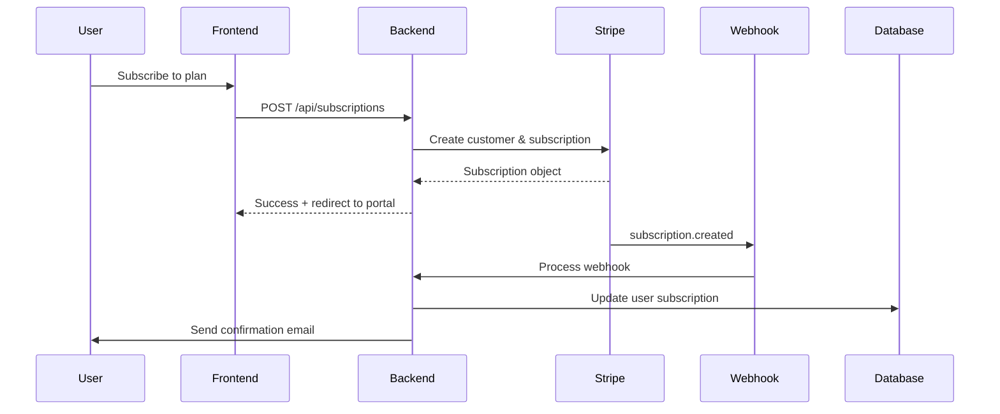
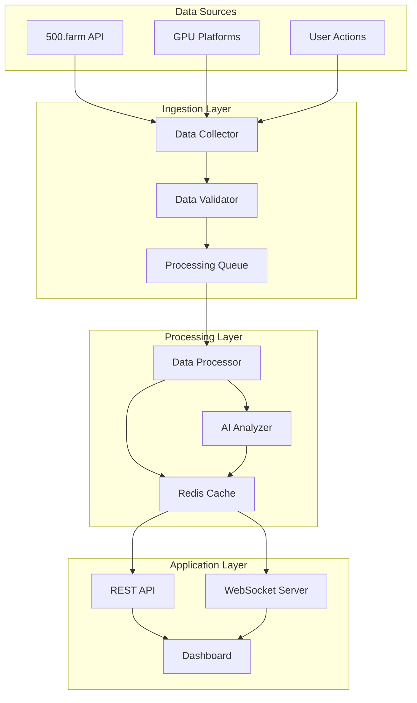
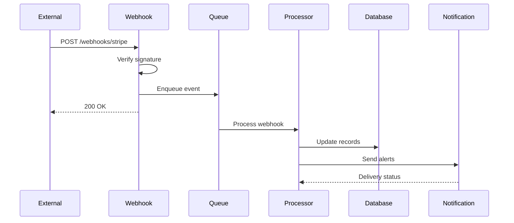

# System Integrations

## External Services

### Primary Data Source: 500.farm API

**Service**: 500.farm GPU hosting market data API  
**Integration Type**: REST API with real-time polling  
**Authentication**: API key (currently free, no authentication required)  
**Update Frequency**: Every 15 minutes for market data, hourly for trend analysis  

**Endpoints Used**:
- `GET /api/gpu-pricing`: Current pricing across all platforms
- `GET /api/utilization`: GPU utilization rates by model and platform
- `GET /api/demand`: Market demand indicators and forecasts
- `GET /api/historical`: Historical pricing and utilization data

**Data Processing**:
```javascript
// 500.farm data ingestion pipeline
const farmDataProcessor = {
  async fetchMarketData() {
    const response = await fetch('https://500.farm/api/gpu-pricing');
    const data = await response.json();
    return this.normalizeData(data);
  },
  
  normalizeData(rawData) {
    return rawData.map(item => ({
      gpu_model: item.model,
      platform: item.platform,
      region: item.region || 'global',
      average_price: parseFloat(item.price),
      utilization_rate: parseFloat(item.utilization),
      timestamp: new Date(item.updated_at)
    }));
  },
  
  async storeMarketData(data) {
    // Batch upsert to market_data table
    await db.batchUpsert('market_data', data);
  }
};
```

**Error Handling**:
- **Retry Logic**: Exponential backoff (1s, 2s, 4s, 8s, 16s) with maximum 5 attempts
- **Fallback Strategy**: Use cached data up to 4 hours old if API unavailable
- **Graceful Degradation**: Display "Data temporarily unavailable" message
- **Monitoring**: Alert if API fails for more than 30 minutes

**Risk Mitigation**:
- **Data Validation**: Schema validation for all incoming data
- **Rate Limiting**: Respect API limits and implement request queuing
- **Backup Plan**: Begin development of direct platform integrations (Phase 2)
- **Local Caching**: Store 48 hours of historical data for continuity

### Payment Processing: Stripe

**Service**: Stripe payment processing and subscription management  
**Integration Type**: Stripe SDK + Webhooks  
**Authentication**: API keys (test/live) with webhook signing  

**Key Features**:
- Subscription management with proration
- Multiple payment methods (cards, ACH, international)
- Tax calculation and compliance
- Dunning management for failed payments
- Customer portal for self-service

**Integration Architecture**:


**Webhook Events Handled**:
- `subscription.created`: New subscription activation
- `subscription.updated`: Plan changes and proration
- `subscription.deleted`: Subscription cancellation
- `invoice.payment_succeeded`: Successful payment processing
- `invoice.payment_failed`: Failed payment handling and dunning
- `customer.subscription.trial_will_end`: Trial expiration notifications

**Error Handling**:
- **Webhook Verification**: Cryptographic signature verification
- **Idempotency**: Handle duplicate webhook delivery
- **Retry Logic**: Failed webhook processing with exponential backoff
- **Manual Reconciliation**: Daily sync between Stripe and local database

### AI Services Integration

#### Claude AI (Anthropic)
**Service**: Primary conversational AI for GPU hosting expertise  
**Integration Type**: REST API with conversation context management  
**Authentication**: API key authentication  

**Usage Patterns**:
- User questions about GPU hosting optimization
- Portfolio analysis and recommendations
- Market trend interpretation and advice
- Troubleshooting and technical support

**Cost Management**:
```javascript
// AI usage tracking and cost optimization
const aiManager = {
  async sendClaude(userId, message, context) {
    const usage = await this.trackUsage(userId);
    if (usage.monthlyTokens > this.getTierLimit(userId)) {
      throw new UsageLimitError('Monthly AI limit reached');
    }
    
    const response = await claude.messages.create({
      model: 'claude-3-sonnet',
      max_tokens: 1000,
      messages: this.buildContext(context, message)
    });
    
    await this.logUsage(userId, response.usage);
    return response.content[0].text;
  },
  
  getTierLimit(userId) {
    const tier = this.getUserTier(userId);
    return {
      free: 50_000,      // 50k tokens/month
      individual: 200_000, // 200k tokens/month  
      professional: 1_000_000, // 1M tokens/month
      enterprise: -1     // unlimited
    }[tier];
  }
};
```

#### Gemini AI (Google)
**Service**: Secondary AI for data analysis and bulk processing  
**Integration Type**: Google AI Studio API  
**Authentication**: API key authentication  

**Usage Patterns**:
- Bulk market data analysis
- Portfolio optimization calculations
- Trend prediction and forecasting
- Cost-effective processing for analytical tasks

### Communication Services

#### Discord Integration
**Service**: Discord API for community engagement and notifications  
**Integration Type**: Discord Bot + Webhooks  
**Authentication**: Bot token authentication  

**Bot Capabilities**:
- Portfolio performance summaries in DMs
- Market alert notifications
- Community Q&A assistance
- Integration with Discord community channels

**Webhook Delivery**:
```javascript
// Discord notification delivery
const discordNotifier = {
  async sendAlert(userId, alertData) {
    const user = await this.getDiscordUser(userId);
    if (!user.discord_id) return false;
    
    const embed = {
      title: alertData.title,
      description: alertData.description,
      color: this.getAlertColor(alertData.severity),
      fields: [
        { name: 'GPU Model', value: alertData.gpu_model, inline: true },
        { name: 'Expected Impact', value: alertData.impact, inline: true },
        { name: 'Action Required', value: alertData.action, inline: false }
      ],
      timestamp: new Date().toISOString()
    };
    
    await discord.users.send(user.discord_id, { embeds: [embed] });
  }
};
```

#### Email Service
**Service**: SendGrid for transactional emails  
**Integration Type**: SendGrid Web API  
**Authentication**: API key authentication  

**Email Types**:
- Welcome and onboarding sequences
- Portfolio performance reports
- Alert notifications (backup to Discord)
- Billing and subscription notifications
- Password reset and security alerts

**Template Management**:
- Dynamic templates with personalization
- A/B testing for engagement optimization
- Responsive design for mobile compatibility
- Unsubscribe management and preferences

## Internal Integrations

### Real-time Data Pipeline

**Architecture Overview**:


**Data Flow Management**:
```javascript
// Real-time data processing pipeline
class DataPipeline {
  async processMarketData(data) {
    // 1. Validate incoming data
    const validated = await this.validateData(data);
    
    // 2. Enrich with historical context
    const enriched = await this.enrichData(validated);
    
    // 3. Trigger AI analysis for insights
    const insights = await this.generateInsights(enriched);
    
    // 4. Update cache and notify subscribers
    await this.updateCache(enriched, insights);
    await this.notifySubscribers(enriched, insights);
    
    // 5. Store in database for historical analysis
    await this.persistData(enriched, insights);
  }
  
  async notifySubscribers(data, insights) {
    // WebSocket notifications for real-time dashboard updates
    this.wsServer.broadcast('market_update', data);
    
    // Check for alert triggers
    await this.checkAlertTriggers(data, insights);
  }
}
```

### MCP Tools Integration

#### Monitoring and Observability
**Grafana Integration**: Custom dashboards for business and technical metrics
```javascript
// Grafana metrics export
const grafanaExporter = {
  exportBusinessMetrics() {
    return {
      active_users: this.getActiveUserCount(),
      subscription_revenue: this.getMonthlyRevenue(),
      ai_api_costs: this.getAIApiCosts(),
      churn_rate: this.getChurnRate(),
      nps_score: this.getNPSScore()
    };
  },
  
  exportTechnicalMetrics() {
    return {
      api_response_time: this.getApiResponseTime(),
      database_connections: this.getDbConnectionCount(),
      cache_hit_rate: this.getCacheHitRate(),
      error_rate: this.getErrorRate(),
      external_api_health: this.getExternalApiHealth()
    };
  }
};
```

**DataDog Integration**: Application performance monitoring and alerting
- Custom metrics for user engagement and business KPIs
- Distributed tracing for request flow analysis
- Log aggregation with structured logging
- Automated alerting for performance degradation

**Sentry Integration**: Error tracking and performance monitoring
- Real-time error alerts with context and stack traces
- Performance monitoring for slow database queries
- Release tracking and deployment health monitoring
- User feedback collection for error reports

### Webhook Architecture

**Incoming Webhooks** (from external services):


**Outgoing Webhooks** (to user applications):
```javascript
// User-configured webhook delivery
class WebhookDelivery {
  async deliverWebhook(userId, event, data) {
    const webhooks = await this.getUserWebhooks(userId, event);
    
    for (const webhook of webhooks) {
      try {
        await this.sendWebhook(webhook, event, data);
        await this.logDelivery(webhook.id, 'success');
      } catch (error) {
        await this.handleDeliveryFailure(webhook, error);
      }
    }
  }
  
  async sendWebhook(webhook, event, data) {
    const payload = {
      event: event,
      timestamp: new Date().toISOString(),
      data: data,
      signature: this.generateSignature(webhook.secret, data)
    };
    
    const response = await fetch(webhook.url, {
      method: 'POST',
      headers: {
        'Content-Type': 'application/json',
        'X-GPUScout-Event': event,
        'X-GPUScout-Signature': payload.signature
      },
      body: JSON.stringify(payload)
    });
    
    if (!response.ok) {
      throw new Error(`Webhook delivery failed: ${response.status}`);
    }
  }
}
```

## Future Platform Integrations

### Phase 2 Integrations (Months 4-6)

#### RunPod API Integration
**Purpose**: Direct integration for portfolio management and real-time data
**Authentication**: API key authentication
**Capabilities**:
- Instance management and monitoring
- Real-time utilization and earnings data
- Automated pricing optimization
- Fleet management for multiple instances

#### Lambda Labs API Integration  
**Purpose**: Multi-platform portfolio optimization
**Authentication**: API key authentication
**Capabilities**:
- Cross-platform pricing comparison
- Automated resource allocation
- Performance benchmarking
- Cost optimization recommendations

### Phase 3 Integrations (Months 7-12)

#### Additional GPU Platforms
- **Vast.ai**: Spot instance optimization
- **Genesis Cloud**: European market focus
- **PaperSpace**: Professional tier features
- **Custom Platforms**: White-label integration support

#### Business Intelligence Tools
- **HubSpot**: Customer relationship management
- **Mixpanel**: Advanced user analytics
- **Segment**: Event tracking and customer data platform
- **Zapier**: No-code integration marketplace

## Integration Testing Strategy

### Mock Services Development
```javascript
// Mock 500.farm API for testing
class Mock500Farm {
  constructor() {
    this.data = this.generateMockData();
  }
  
  async getGPUPricing() {
    // Return realistic but controlled test data
    return this.data.pricing;
  }
  
  generateMockData() {
    return {
      pricing: [
        { model: 'RTX 4090', platform: 'RunPod', price: 0.75, utilization: 85 },
        { model: 'RTX 4090', platform: 'Lambda', price: 0.80, utilization: 78 },
        // ... more test data
      ]
    };
  }
}
```

### Contract Testing
- **API Contract Validation**: Ensure external APIs match expected schemas
- **Webhook Contract Testing**: Verify webhook payload structures
- **Integration Test Suite**: Automated testing of all external integrations
- **Regression Testing**: Validate integration stability across deployments

### Testcontainers Usage
```javascript
// Integration testing with real services
describe('Database Integration', () => {
  let postgres;
  let redis;
  
  beforeAll(async () => {
    postgres = await new PostgreSqlContainer('postgres:15')
      .withDatabase('gpuscout_test')
      .withUsername('test')
      .withPassword('test')
      .start();
      
    redis = await new RedisContainer('redis:7')
      .start();
  });
  
  afterAll(async () => {
    await postgres.stop();
    await redis.stop();
  });
  
  it('should handle user portfolio data correctly', async () => {
    // Test real database operations
  });
});
```

### Performance Testing
- **Load Testing**: Simulate high traffic scenarios
- **Stress Testing**: Test system limits and failure modes
- **Chaos Engineering**: Random failure injection for resilience testing
- **End-to-End Testing**: Full user journey validation with real integrations

## Error Handling and Resilience

### Circuit Breaker Pattern
```javascript
// Circuit breaker for external API calls
class CircuitBreaker {
  constructor(service, options = {}) {
    this.service = service;
    this.failureThreshold = options.failureThreshold || 5;
    this.timeout = options.timeout || 60000;
    this.state = 'CLOSED'; // CLOSED, OPEN, HALF_OPEN
    this.failureCount = 0;
    this.lastFailureTime = null;
  }
  
  async call(method, ...args) {
    if (this.state === 'OPEN') {
      if (Date.now() - this.lastFailureTime < this.timeout) {
        throw new Error('Circuit breaker is OPEN');
      }
      this.state = 'HALF_OPEN';
    }
    
    try {
      const result = await this.service[method](...args);
      this.onSuccess();
      return result;
    } catch (error) {
      this.onFailure();
      throw error;
    }
  }
  
  onSuccess() {
    this.failureCount = 0;
    this.state = 'CLOSED';
  }
  
  onFailure() {
    this.failureCount++;
    this.lastFailureTime = Date.now();
    
    if (this.failureCount >= this.failureThreshold) {
      this.state = 'OPEN';
    }
  }
}
```

### Retry Strategies
- **Exponential Backoff**: For temporary failures and rate limiting
- **Linear Backoff**: For predictable service maintenance windows
- **Immediate Retry**: For network blips and transient errors
- **Dead Letter Queue**: For persistent failures requiring manual intervention

### Fallback Mechanisms
- **Cached Data**: Serve stale data when live data unavailable
- **Degraded Mode**: Reduced functionality during outages
- **Alternative Endpoints**: Backup data sources and services
- **Graceful Degradation**: Progressive enhancement approach

This integration architecture ensures GPUScout can reliably connect with external services while maintaining system stability and user experience. The emphasis on resilience and fallback mechanisms addresses the critical dependency risks identified in the business constraints, particularly the reliance on the 500.farm API.