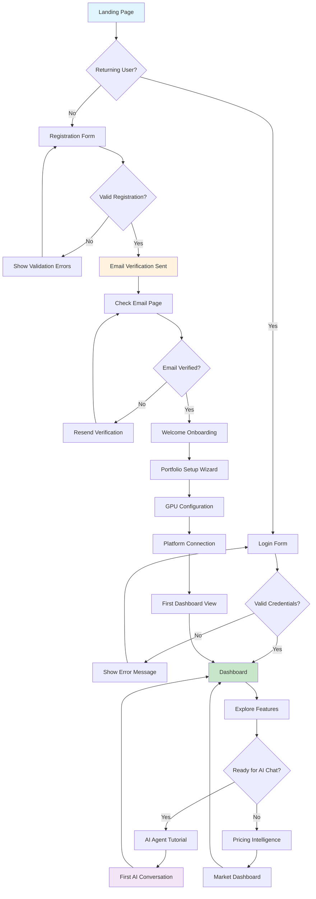
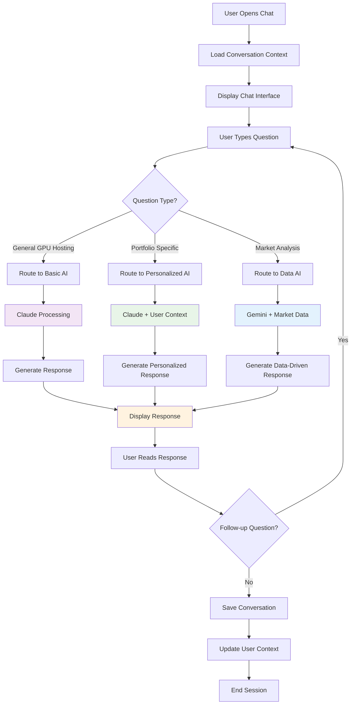
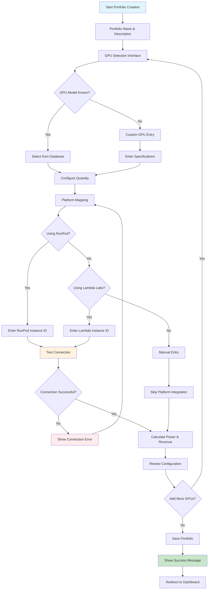
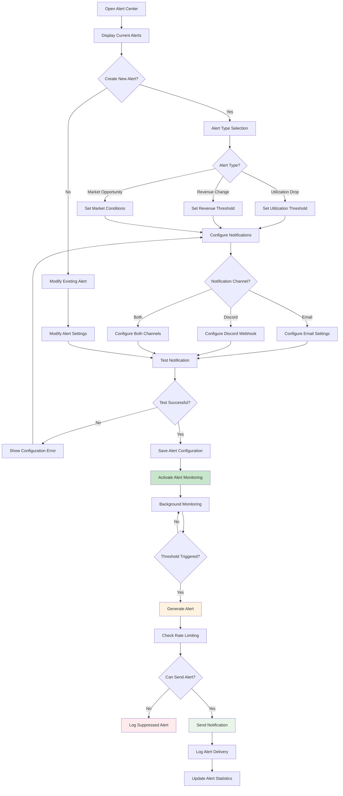
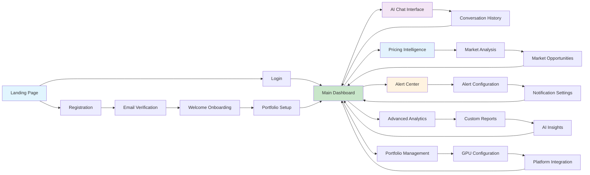
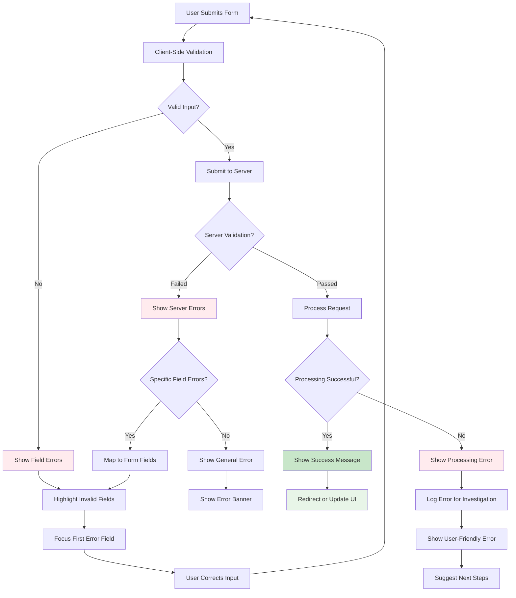
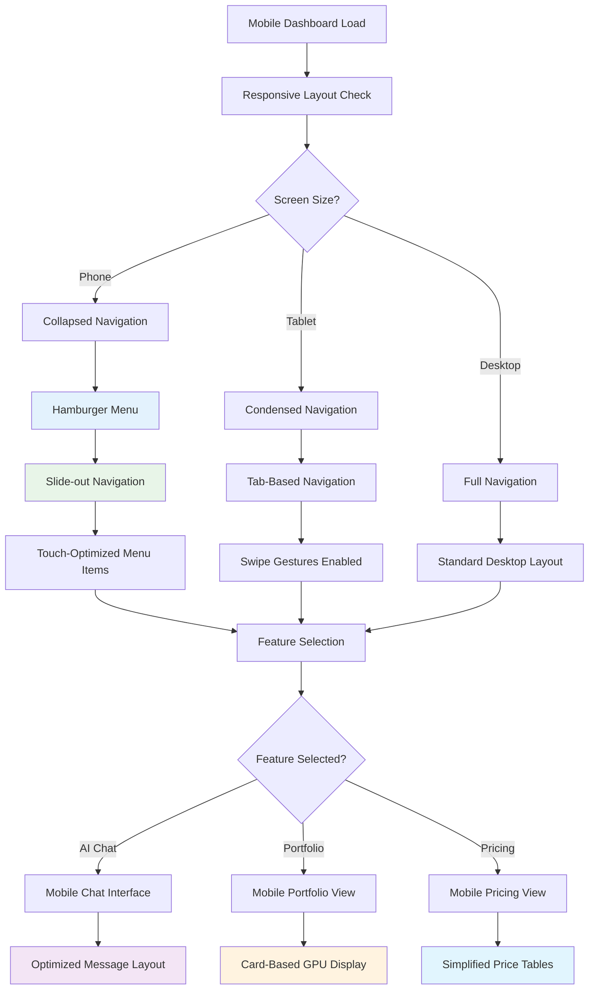
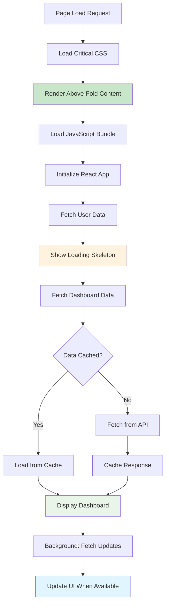

# User Flow Diagrams

## Registration & Onboarding Flow



## Core User Journeys

### Journey 1: First-time User (David - Aspiring Host)

**Objective**: Learn GPU hosting basics and set up first monitoring setup

**Flow Stages**:
1. **Discovery**: Finds GPUScout through Discord recommendation
2. **Registration**: Creates free account to explore features
3. **Education**: Uses AI agent to learn GPU hosting fundamentals
4. **Setup**: Configures single RTX 3090 for monitoring
5. **Learning**: Explores pricing intelligence and market trends
6. **Decision**: Decides whether to proceed with GPU hosting

**Key Decision Points**:
- Trust: Does the platform feel credible and operator-built?
- Education: Can I learn what I need to get started safely?
- Value: Will this help me avoid costly beginner mistakes?

**Success Metrics**:
- Completes onboarding within 15 minutes
- Asks at least 5 questions to AI agent in first session
- Returns within 48 hours to check market data
- Conversion to paid tier within 60 days as income grows

### Journey 2: Daily Dashboard Usage (Alex - Individual Host)

**Objective**: Monitor 2x RTX 4090 performance and optimize pricing

**Flow Stages**:
1. **Morning Check**: Reviews overnight performance and any alerts
2. **Market Analysis**: Compares current pricing against market rates
3. **AI Consultation**: Asks specific questions about optimization
4. **Action Items**: Implements recommended pricing or configuration changes
5. **Alert Configuration**: Adjusts thresholds based on seasonal patterns

**Key Decision Points**:
- Performance: Are my GPUs performing as expected?
- Pricing: Am I leaving money on the table with current rates?
- Optimization: What actions will have the biggest impact?

**Success Metrics**:
- Daily active usage for 5+ days per week
- Revenue increase of 5-10% within 30 days
- Alert response time under 15 minutes
- Upgrade to Individual tier within 60 days

### Journey 3: Portfolio Optimization (Maria - Small Farm Operator)

**Objective**: Optimize 12 GPU fleet across multiple platforms

**Flow Stages**:
1. **Fleet Overview**: Analyze performance across all GPUs and platforms
2. **Comparative Analysis**: Benchmark against similar operations
3. **Opportunity Identification**: Find underperforming assets or market gaps
4. **Strategic Planning**: Plan hardware upgrades or platform changes
5. **Implementation**: Execute optimization recommendations
6. **Monitoring**: Track results and adjust strategy

**Key Decision Points**:
- ROI: Which optimizations will deliver the best return?
- Scale: Should I expand capacity or optimize existing assets?
- Platform: Am I using the best platforms for my hardware?

**Success Metrics**:
- Portfolio revenue increase of 10-15% within 90 days
- Reduced manual monitoring time by 50%
- Successful hardware expansion decisions
- Upgrade to Professional tier for advanced features

## Detailed Flow Diagrams

### AI Agent Interaction Flow



### Portfolio Setup & Configuration Flow



### Alert Configuration & Delivery Flow



## Screen Flow Map



## Error State Flows

### Connection Failure Recovery

```mermaid
flowchart TD
    A[API Call Made] --> B{Response Received?}
    B -->|No| C[Show Loading State]
    C --> D[Timeout After 30s]
    D --> E[Show Connection Error]
    E --> F{Retry Available?}
    F -->|Yes| G[Show Retry Button]
    F -->|No| H[Show Fallback Content]
    
    G --> I[User Clicks Retry]
    I --> A
    
    B -->|Yes| J{Response Valid?}
    J -->|No| K[Show Data Error]
    J -->|Yes| L[Display Content]
    
    K --> M[Log Error Details]
    M --> N[Show User-Friendly Message]
    N --> O[Suggest Alternative Action]
    
    H --> P[Display Cached Data]
    P --> Q[Show "Data May Be Outdated" Warning]
    
    style E fill:#ffebee
    style K fill:#ffebee
    style H fill:#fff3e0
    style L fill:#c8e6c9
```

### Form Validation & Error Handling



## Mobile-Responsive Flow Considerations

### Mobile Dashboard Navigation



## Performance Optimization Flow

### Progressive Loading Strategy



## Analytics & Conversion Tracking

### User Engagement Flow Tracking

**Key Metrics to Track**:
- Registration completion rate
- Onboarding step completion
- Time to first AI question
- Portfolio setup completion
- Daily active usage patterns
- Feature adoption rates
- Conversion to paid tiers

**Conversion Funnel Stages**:
1. Landing page view → Registration start (20-30% expected)
2. Registration start → Email verification (70-80% expected)
3. Email verification → Portfolio setup (80-90% expected)
4. Portfolio setup → First AI interaction (60-70% expected)
5. Active usage → Paid conversion (15-20% expected after 30 days)

**A/B Testing Opportunities**:
- Registration form length and fields
- Onboarding flow complexity and guidance
- AI chat introduction and tutorial
- Pricing page design and messaging
- Dashboard layout and feature prominence

This comprehensive user flow design ensures optimal user experience across all devices and user types, with clear paths to value realization and conversion. The flows are designed to support AI-assisted development by providing detailed specifications for each interaction and decision point.