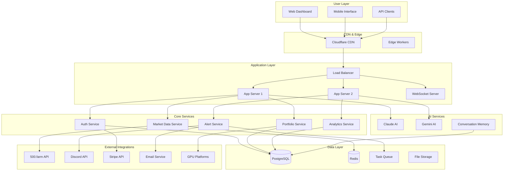
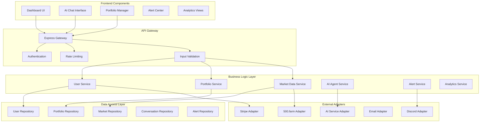
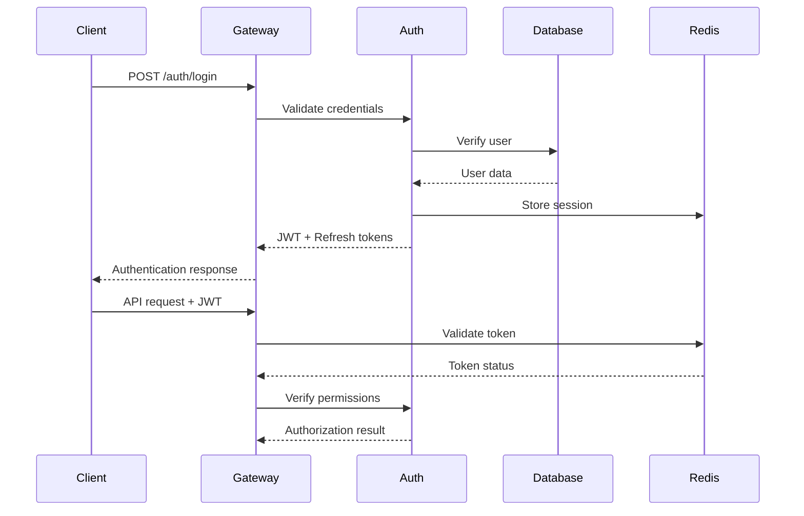
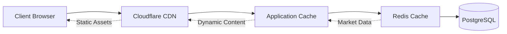

# System Architecture Design

## Architecture Overview

GPUScout is designed as a modern, scalable SaaS platform that transforms GPU hosting from manual guesswork into data-driven optimization. Built with an AI-first approach, the architecture emphasizes real-time analytics, seamless integrations, and exceptional user experience while maintaining cost efficiency.

## Technology Stack

### Frontend
- **Framework**: Next.js 14 with TypeScript
  - Server-side rendering for optimal performance
  - Built-in optimization and code splitting
  - Excellent developer experience and community support
- **State Management**: Zustand
  - Lightweight and performant
  - TypeScript-first design
  - Minimal boilerplate compared to Redux
- **UI Library**: Tailwind CSS + shadcn/ui
  - Rapid development with consistent design system
  - Customizable components built on Radix UI
  - Mobile-first responsive design
- **Build Tools**: Vite (for development) + Next.js build pipeline
  - Fast hot module replacement
  - Optimized production builds
  - Tree shaking and code splitting

### Backend
- **Runtime**: Node.js 20+ LTS
  - Excellent performance for I/O intensive operations
  - Rich ecosystem for integrations
  - Native TypeScript support
- **Framework**: Express.js with TypeScript
  - Mature, well-documented framework
  - Extensive middleware ecosystem
  - Easy integration with WebSocket servers
- **Database**: PostgreSQL 15+
  - ACID compliance for billing and user data
  - JSON/JSONB support for analytics data
  - Excellent performance and reliability
- **Cache**: Redis 7+
  - Session management and JWT blacklisting
  - Real-time data caching from 500.farm
  - Rate limiting and request throttling

### Infrastructure
- **Hosting**: LynxLab servers (existing infrastructure)
  - Cost-effective for initial deployment
  - Direct control over scaling decisions
  - Existing operational expertise
- **CDN**: Cloudflare
  - Global content delivery and edge caching
  - DDoS protection and security features
  - Edge workers for dynamic content optimization
- **Monitoring**: Integrated observability stack
  - Application Performance Monitoring (APM)
  - Error tracking and alerting
  - Business metrics dashboard

### AI Integration
- **Primary AI**: Claude (Anthropic) for conversational AI
  - Superior reasoning and context understanding
  - Excellent for complex GPU hosting advice
  - Cost-effective for expected usage patterns
- **Secondary AI**: Gemini for data analysis
  - Strong analytical capabilities
  - Competitive pricing for bulk operations
  - Good integration with Google ecosystem

## Component Architecture

## API Design Principles

### RESTful Conventions
- **Resource-based URLs**: `/api/v1/users/{id}/portfolios`
- **HTTP Methods**: GET (read), POST (create), PUT (update), DELETE (remove)
- **Status Codes**: Consistent use of 2xx (success), 4xx (client error), 5xx (server error)
- **Content Negotiation**: JSON for API, HTML for server-side rendering

### Authentication Strategy
- **JWT Tokens**: Stateless authentication with Redis blacklisting for logout
- **Refresh Tokens**: Long-lived tokens for automatic session renewal
- **Multi-Factor Authentication**: TOTP-based 2FA for enhanced security
- **Role-Based Access**: User roles (free, individual, professional, enterprise)

### Rate Limiting Approach
- **User-based Limits**: Different quotas based on subscription tier
- **Feature-based Limits**: AI chat interactions, API calls, alert frequency
- **IP-based Protection**: Basic DDoS protection and abuse prevention
- **Graceful Degradation**: Clear error messages with retry guidance

### Error Handling Standards
- **Consistent Format**: Standard error response structure with codes and messages
- **Localization**: Error messages in user's preferred language
- **Logging**: Comprehensive error logging for debugging and monitoring
- **User-Friendly**: Technical errors translated to actionable user guidance

## Security Architecture

### Authentication Flow

### Authorization Model
- **Subscription Tiers**: Free, Individual ($19/month), Professional ($49/month), Enterprise ($99+/month)
- **Feature Permissions**: Granular access control based on subscription level
- **API Quotas**: Rate limiting integrated with subscription benefits
- **Data Isolation**: Multi-tenant architecture with strict data separation

### Data Encryption
- **In Transit**: TLS 1.3 for all client-server communication
- **At Rest**: AES-256 encryption for sensitive data (passwords, payment info)
- **Database**: PostgreSQL native encryption for specific columns
- **API Keys**: Encrypted storage for third-party service credentials

### API Security Measures
- **Input Validation**: Comprehensive validation using JSON Schema
- **SQL Injection Prevention**: Parameterized queries and ORM usage
- **XSS Protection**: Content Security Policy and output sanitization
- **CSRF Protection**: SameSite cookies and CSRF tokens

## Scalability Design

### Horizontal Scaling Approach
- **Stateless Services**: All application logic designed for horizontal scaling
- **Load Balancing**: Round-robin with health checks and automatic failover
- **Database Scaling**: Read replicas for analytics queries, write to primary
- **Service Isolation**: Microservices-light architecture for independent scaling

### Caching Strategy

- **CDN Layer**: Static assets, API responses with appropriate TTL
- **Application Layer**: In-memory caching for frequently accessed data
- **Redis Layer**: Session data, market data, computed analytics
- **Database Layer**: Query result caching and connection pooling

### Database Optimization
- **Indexing Strategy**: Optimized indexes for common query patterns
- **Partitioning**: Time-based partitioning for analytics and market data
- **Connection Pooling**: Efficient database connection management
- **Query Optimization**: Regular query performance analysis and optimization

### CDN Utilization
- **Global Distribution**: Cloudflare's global edge network for reduced latency
- **Smart Routing**: Automatic routing to nearest edge location
- **Bandwidth Optimization**: Compression and image optimization
- **API Caching**: Cached API responses with smart invalidation

## Performance Targets

### Response Time Requirements
- **Dashboard Load**: <2 seconds initial load, <500ms subsequent navigation
- **API Responses**: <200ms for simple queries, <500ms for complex analytics
- **AI Chat**: <3 seconds for response generation, <1 second for simple queries
- **Real-time Updates**: <100ms for WebSocket message delivery

### Availability Standards
- **Uptime Target**: 99.5% availability (maximum 3.6 hours downtime per month)
- **Recovery Time**: <15 minutes for planned maintenance, <1 hour for critical issues
- **Backup Strategy**: Automated daily backups with point-in-time recovery
- **Disaster Recovery**: Cross-region backup with 4-hour RTO target

### Scalability Metrics
- **Concurrent Users**: 100 users (Month 1) → 1,000 users (Month 6) → 10,000 users (Year 2)
- **API Throughput**: 1,000 requests/minute baseline, scaling to 10,000+ requests/minute
- **Database Growth**: Planning for 100GB data growth in Year 1
- **Real-time Connections**: Support for 1,000+ concurrent WebSocket connections

## Monitoring and Observability

### Application Monitoring
- **Performance Metrics**: Response times, throughput, error rates
- **Business Metrics**: User engagement, conversion rates, revenue metrics
- **Infrastructure Metrics**: Server resources, database performance, cache hit rates
- **Security Metrics**: Failed authentication attempts, suspicious activity patterns

### Alerting Strategy
- **Critical Alerts**: System downtime, security breaches, payment failures
- **Warning Alerts**: Performance degradation, high error rates, capacity thresholds
- **Business Alerts**: Subscription milestones, user behavior anomalies
- **Integration Health**: External API failures, data source interruptions

### Logging Architecture
- **Structured Logging**: JSON format with consistent fields across services
- **Log Aggregation**: Centralized logging with search and analysis capabilities
- **Retention Policy**: 90 days for operational logs, 1 year for audit logs
- **Privacy Compliance**: PII sanitization and secure log handling

This architecture design balances the need for rapid AI-assisted development with enterprise-grade scalability and reliability, ensuring GPUScout can grow from the initial community-focused MVP to a market-leading platform serving thousands of GPU hosts globally.